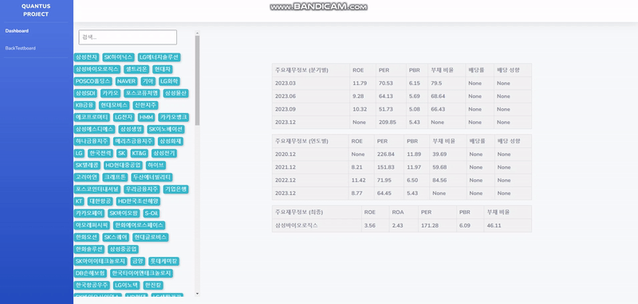
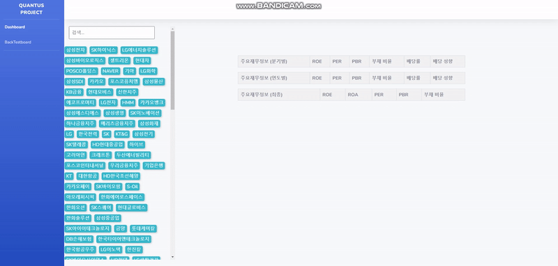

## shell script (for window)
``` 
> python -m venv venv
> venv\Scripts\activate
> pip install -r requirements.txt   
> python manage.py makemigrations  
> pytthon manage.py migrate 
> python manage.py crawling_command  # 최초 업로드시 데이터를 크롤링하여 데이터 베이스에 저장.
> python manage.py runserver

- 해당 프로젝트는 맥 or 리눅스 환경에서 'pip install -r requirements.txt' 코드 동작시 에러가 발생합니다.
- 에러 해결 방법 : requirements.txt파일의 "TA-Lib @ file:///C:/...." 을 주석처리 한뒤 TA-Lib 라이브러리를 해당 OS환경에 맞게 설치해야합니다.
- 또는 도커 환경에서 도커를 설치후 실행시킨뒤 아래 명령어를 입력하면 도커 컨테이너 환경에서 해당 프로젝트를 실행시킬 수 있습니다.
> docker build -f "Dockerfile" -t django/backtest_project .
> docker-compose up
```

## 프로젝트 소개

이 프로그램은 Django 프레임워크를 기반으로 하여, 웹 인터페이스를 통해 사용자가 편리하게 백테스트를 수행할 수 있도록 설계되었습니다. 현제는 코스피 200의 데이터만 크롤링하여 테스트하고, 결과를 분석할 수 있는 기능을 제공합니다. 이 프로그램은 전략 개발자, 트레이더, 금융 분석가들에게 복잡한 금융 모델링과 데이터 분석을 손쉽게 할 수 있도록 지원하는것을 목적으로 합니다.

## 프로젝트 진행 과정

1. 주식 종목 선정 및 모델 정의

    - 종목 선정 : 프로젝트의 첫단계로 주식 종목을 선정하고 모델을 정의 하였습니다.
        주식 종목은 코스피 200에 선정된 200개의 주식을 선정하였습니다.

    - 모델 정의 :
        코스피 200 해당하는 주식 목록을 네이버 크롤링을 통해 데이터를 수집한뒤 네이버 크롤링을 통해서 해당 주식의 2020 ~ 2023년에 해당하는 주요재무지표 데이터를 수집하였고. 2023년에 해당하는 분기별 데이터를 수집하여 데이터베이스에 저장하였습니다.
    
    - 모델 수정 :
        1-2에서 네이버 크롤링으로 수집한 지표를 활용하여 "투자 종목 추출 로직 설계"에 활용하려고 했지만 본사 문의결과 계산된 지표는 활용하지 말고 직접 계산한 지표를 활용하라는 답변을 받고. 모델을 수정하였습니다.
        1-2에서 수집한 지표는 Dashboard에 데이터 조회용으로 활용하였고
        dart-open-api를 활용해 코스피 200에 해당하는 종목들의 재무재표데이터를 활용하여 per, pbr, roe, roa, 부채비율 등의 데이터를 직접 계산하여 데이터 베이스에 저장하였습니다.
        원래 첫 모델 정의에선 "투자 종목 추출 로직 설계"에 배당성향, 배당 비율등 다른 지표를 활용하려고 했지만 dart-open-api에서 해당 지표를 직접 크롤링하여 계산하는데 많은 어려움을 격고 시간상의 문제로 per, pbr, roe, roa, 부채비율 데이터만 활용하기로 했습니다.

2. ui 구성 

    1. DashBoard : DashBoard페이지에선 코스피 200에 해당하는 종목을 조회하여 2022년 부터의 각 연도별 주요재무데이터를 조회할 수 있습니다.
        
    2. BackTestBoard 
        - BackTestBoard에 상단에선 per, pbr, roe, roa, 부채 비율등을 입력하여 입력 값들의 조건에 따라 투자 종목을 추출합니다.
        - 추출한 종목을 도시화 합니다.
        - 기간을 설정하여 해당 기간과 추출한 종목에 대한 백테스트를 진행합니다.
        

3. backtest 로직 설계

    - 백테스트 전략은 "단순 이동 평균 교차 전략"을 사용합니다.
    전략 선정 이유는 이 전략이 이해하고 적용하기 쉬우며, 매수 및 매도 시점이 명확하기 때문입니다. 평소 주식이나 투자에 관심이 많아 관련 뉴스나 관련 유튜브 영상(삼프로, 815 등등...)을 즐겨 시청하지만 주로 거시경제에 대한 정보와 지표를 주로 활용하여 장기투자를 즐겨하기 때문에 매매전략에 대한 기본지식이 부족하여 가장 이해하고 적용하기 쉬운 투자 전략을 택했습니다.

    단순 이동 평균 교차 전략이란? : 주식의 종가 데이터를 받아 단순 이동 평균(SMA)을 계산한다. 여기서는 50일 평균을 사용한다.

    - 단순 이동 평균 교차 전략의 세부 내용은 아래와 같습니다.
        - 수수료는 0.2%로 가정한다.
        - 매수 매도 전략은 단순 이동 평균 교차(Simple Moving Average Crossover) 전략을 사용한다.
        - 단순 이동 평균 교차 전략이란? : 주식의 종가 데이터를 받아 단순 이동 평균(SMA)을 계산한다. 여기서는 50일 평균을 사용한다.
        이 메소드는 각 시간 단계에서 호출된다. 만약 현재 종가가 50일 이동 평균보다 높으면 매수 신호로 간주하고 매수를 실행한다.
    
    - 해당 프로그렘에서 백테스트를 진행하면 월별 전체 포트폴리오의 누적수익률과, 각 종목별 수익률 그래프를 시각화하여 보실수 있습니다.


